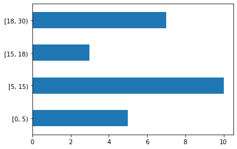
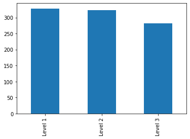
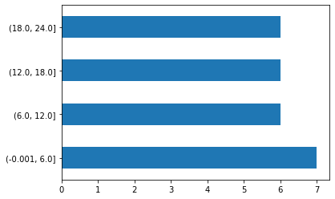
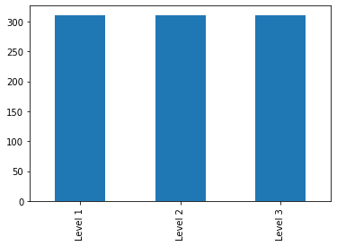

# Principles of Data Visualization

## Assignment 2 | Due Date : 23 Nov 2021

## NumPy and Pandas

1. For the given dataset, create few Null data perform the following 
   1.  Identifying NAN/NA values 

   2.  Filtering out NAN/NA values 

   3.  Filling NA values 

   4. Drop NA values.           
    
  
2. Create a data array and perform data binning using Cut and QCut Pandas functions  

###  1. For the given dataset, create few Null data perform the following 
       A.  Identifying NAN/NA values 
       B.  Filtering out NAN/NA values 
       C.  Filling NA values 
       D.  Drop NA values. 
```python
#import pandas
import pandas as pd

#Create a dataframe
df = pd.read_csv("employees.csv")
df.head(10)
```

```python
#Identifying NAN/NA Values in Teams Column
df['Team'].isnull()
```


    0      False
    1       True
    2      False
    3      False
    4      False
           ...  
    995    False
    996    False
    997    False
    998    False
    999    False
    Name: Team, Length: 1000, dtype: bool


```python
#Filtering out  NaN/Na values in Team coulumn
df[df['Team'].isnull()]     
```


<div>
<style scoped>
    .dataframe tbody tr th:only-of-type {
        vertical-align: middle;
    }

    .dataframe tbody tr th {
        vertical-align: top;
    }

    .dataframe thead th {
        text-align: right;
    }
</style>
<table border="1" class="dataframe">
  <thead>
    <tr style="text-align: right;">
      <th></th>
      <th>First Name</th>
      <th>Gender</th>
      <th>Start Date</th>
      <th>Last Login Time</th>
      <th>Salary</th>
      <th>Bonus %</th>
      <th>Senior Management</th>
      <th>Team</th>
    </tr>
  </thead>
  <tbody>
    <tr>
      <th>1</th>
      <td>Thomas</td>
      <td>Male</td>
      <td>3/31/1996</td>
      <td>6:53 AM</td>
      <td>61933</td>
      <td>4.170</td>
      <td>True</td>
      <td>NaN</td>
    </tr>
    <tr>
      <th>10</th>
      <td>Louise</td>
      <td>Female</td>
      <td>8/12/1980</td>
      <td>9:01 AM</td>
      <td>63241</td>
      <td>15.132</td>
      <td>True</td>
      <td>NaN</td>
    </tr>
    <tr>
      <th>23</th>
      <td>NaN</td>
      <td>Male</td>
      <td>6/14/2012</td>
      <td>4:19 PM</td>
      <td>125792</td>
      <td>5.042</td>
      <td>NaN</td>
      <td>NaN</td>
    </tr>
    <tr>
      <th>32</th>
      <td>NaN</td>
      <td>Male</td>
      <td>8/21/1998</td>
      <td>2:27 PM</td>
      <td>122340</td>
      <td>6.417</td>
      <td>NaN</td>
      <td>NaN</td>
    </tr>
    <tr>
      <th>91</th>
      <td>James</td>
      <td>NaN</td>
      <td>1/26/2005</td>
      <td>11:00 PM</td>
      <td>128771</td>
      <td>8.309</td>
      <td>False</td>
      <td>NaN</td>
    </tr>
    <tr>
      <th>109</th>
      <td>Christopher</td>
      <td>Male</td>
      <td>4/22/2000</td>
      <td>10:15 AM</td>
      <td>37919</td>
      <td>11.449</td>
      <td>False</td>
      <td>NaN</td>
    </tr>
    <tr>
      <th>139</th>
      <td>NaN</td>
      <td>Female</td>
      <td>10/3/1990</td>
      <td>1:08 AM</td>
      <td>132373</td>
      <td>10.527</td>
      <td>NaN</td>
      <td>NaN</td>
    </tr>
    <tr>
      <th>199</th>
      <td>Jonathan</td>
      <td>Male</td>
      <td>7/17/2009</td>
      <td>8:15 AM</td>
      <td>130581</td>
      <td>16.736</td>
      <td>True</td>
      <td>NaN</td>
    </tr>
    <tr>
      <th>258</th>
      <td>Michael</td>
      <td>Male</td>
      <td>1/24/2002</td>
      <td>3:04 AM</td>
      <td>43586</td>
      <td>12.659</td>
      <td>False</td>
      <td>NaN</td>
    </tr>
    <tr>
      <th>290</th>
      <td>Jeremy</td>
      <td>Male</td>
      <td>6/14/1988</td>
      <td>6:20 PM</td>
      <td>129460</td>
      <td>13.657</td>
      <td>True</td>
      <td>NaN</td>
    </tr>
    <tr>
      <th>314</th>
      <td>Bobby</td>
      <td>Male</td>
      <td>3/31/1996</td>
      <td>5:40 PM</td>
      <td>112117</td>
      <td>6.338</td>
      <td>False</td>
      <td>NaN</td>
    </tr>
    <tr>
      <th>367</th>
      <td>Edward</td>
      <td>Male</td>
      <td>8/4/1989</td>
      <td>6:06 AM</td>
      <td>66067</td>
      <td>10.957</td>
      <td>True</td>
      <td>NaN</td>
    </tr>
    <tr>
      <th>382</th>
      <td>NaN</td>
      <td>Female</td>
      <td>4/18/1996</td>
      <td>3:57 PM</td>
      <td>107024</td>
      <td>12.182</td>
      <td>NaN</td>
      <td>NaN</td>
    </tr>
    <tr>
      <th>434</th>
      <td>Joyce</td>
      <td>Female</td>
      <td>2/7/1995</td>
      <td>7:38 AM</td>
      <td>50701</td>
      <td>14.227</td>
      <td>True</td>
      <td>NaN</td>
    </tr>
    <tr>
      <th>438</th>
      <td>Jason</td>
      <td>Male</td>
      <td>11/20/1998</td>
      <td>2:54 PM</td>
      <td>69244</td>
      <td>6.220</td>
      <td>True</td>
      <td>NaN</td>
    </tr>
    <tr>
      <th>445</th>
      <td>Chris</td>
      <td>Male</td>
      <td>12/12/2006</td>
      <td>1:57 AM</td>
      <td>71642</td>
      <td>1.496</td>
      <td>False</td>
      <td>NaN</td>
    </tr>
    <tr>
      <th>479</th>
      <td>Richard</td>
      <td>Male</td>
      <td>7/4/1997</td>
      <td>11:47 AM</td>
      <td>47647</td>
      <td>18.787</td>
      <td>True</td>
      <td>NaN</td>
    </tr>
    <tr>
      <th>512</th>
      <td>Wanda</td>
      <td>Female</td>
      <td>4/6/1993</td>
      <td>3:11 AM</td>
      <td>78883</td>
      <td>19.695</td>
      <td>False</td>
      <td>NaN</td>
    </tr>
    <tr>
      <th>513</th>
      <td>Jimmy</td>
      <td>Male</td>
      <td>11/19/2013</td>
      <td>7:29 PM</td>
      <td>63549</td>
      <td>19.624</td>
      <td>False</td>
      <td>NaN</td>
    </tr>
    <tr>
      <th>520</th>
      <td>Peter</td>
      <td>Male</td>
      <td>2/22/2003</td>
      <td>9:09 AM</td>
      <td>56580</td>
      <td>8.411</td>
      <td>True</td>
      <td>NaN</td>
    </tr>
    <tr>
      <th>567</th>
      <td>NaN</td>
      <td>Female</td>
      <td>4/1/1980</td>
      <td>8:04 PM</td>
      <td>48141</td>
      <td>12.605</td>
      <td>NaN</td>
      <td>NaN</td>
    </tr>
    <tr>
      <th>573</th>
      <td>Kimberly</td>
      <td>Female</td>
      <td>12/30/1981</td>
      <td>4:51 AM</td>
      <td>81800</td>
      <td>5.435</td>
      <td>True</td>
      <td>NaN</td>
    </tr>
    <tr>
      <th>580</th>
      <td>Harry</td>
      <td>Male</td>
      <td>1/27/1985</td>
      <td>8:18 PM</td>
      <td>65482</td>
      <td>18.089</td>
      <td>False</td>
      <td>NaN</td>
    </tr>
    <tr>
      <th>626</th>
      <td>NaN</td>
      <td>Female</td>
      <td>4/13/1997</td>
      <td>8:03 AM</td>
      <td>131755</td>
      <td>2.930</td>
      <td>NaN</td>
      <td>NaN</td>
    </tr>
    <tr>
      <th>634</th>
      <td>Carl</td>
      <td>Male</td>
      <td>3/30/1987</td>
      <td>5:59 PM</td>
      <td>75598</td>
      <td>19.289</td>
      <td>False</td>
      <td>NaN</td>
    </tr>
    <tr>
      <th>635</th>
      <td>Randy</td>
      <td>Male</td>
      <td>9/27/2000</td>
      <td>3:04 AM</td>
      <td>89831</td>
      <td>13.047</td>
      <td>True</td>
      <td>NaN</td>
    </tr>
    <tr>
      <th>647</th>
      <td>Donald</td>
      <td>Male</td>
      <td>4/6/1988</td>
      <td>10:00 AM</td>
      <td>122920</td>
      <td>5.320</td>
      <td>False</td>
      <td>NaN</td>
    </tr>
    <tr>
      <th>669</th>
      <td>Joseph</td>
      <td>NaN</td>
      <td>3/28/1982</td>
      <td>1:05 PM</td>
      <td>86564</td>
      <td>11.879</td>
      <td>True</td>
      <td>NaN</td>
    </tr>
    <tr>
      <th>684</th>
      <td>Alice</td>
      <td>Female</td>
      <td>1/21/2016</td>
      <td>5:07 PM</td>
      <td>117787</td>
      <td>10.485</td>
      <td>False</td>
      <td>NaN</td>
    </tr>
    <tr>
      <th>706</th>
      <td>Todd</td>
      <td>Male</td>
      <td>7/4/1993</td>
      <td>6:53 PM</td>
      <td>128175</td>
      <td>18.473</td>
      <td>True</td>
      <td>NaN</td>
    </tr>
    <tr>
      <th>726</th>
      <td>Daniel</td>
      <td>Male</td>
      <td>2/29/2016</td>
      <td>4:04 AM</td>
      <td>77287</td>
      <td>13.000</td>
      <td>True</td>
      <td>NaN</td>
    </tr>
    <tr>
      <th>753</th>
      <td>Antonio</td>
      <td>Male</td>
      <td>6/6/1999</td>
      <td>10:54 PM</td>
      <td>41928</td>
      <td>5.478</td>
      <td>True</td>
      <td>NaN</td>
    </tr>
    <tr>
      <th>774</th>
      <td>NaN</td>
      <td>Female</td>
      <td>6/18/2000</td>
      <td>7:36 AM</td>
      <td>106428</td>
      <td>10.867</td>
      <td>NaN</td>
      <td>NaN</td>
    </tr>
    <tr>
      <th>781</th>
      <td>Lawrence</td>
      <td>Male</td>
      <td>7/3/1995</td>
      <td>10:55 PM</td>
      <td>46378</td>
      <td>9.127</td>
      <td>False</td>
      <td>NaN</td>
    </tr>
    <tr>
      <th>794</th>
      <td>Nicole</td>
      <td>Female</td>
      <td>3/1/2004</td>
      <td>5:17 PM</td>
      <td>44021</td>
      <td>10.286</td>
      <td>False</td>
      <td>NaN</td>
    </tr>
    <tr>
      <th>826</th>
      <td>NaN</td>
      <td>NaN</td>
      <td>8/1/1988</td>
      <td>1:35 AM</td>
      <td>87103</td>
      <td>5.665</td>
      <td>NaN</td>
      <td>NaN</td>
    </tr>
    <tr>
      <th>850</th>
      <td>Charles</td>
      <td>Male</td>
      <td>9/3/1997</td>
      <td>10:04 AM</td>
      <td>148291</td>
      <td>6.002</td>
      <td>False</td>
      <td>NaN</td>
    </tr>
    <tr>
      <th>851</th>
      <td>Bobby</td>
      <td>Male</td>
      <td>8/19/1996</td>
      <td>1:16 AM</td>
      <td>147842</td>
      <td>16.158</td>
      <td>True</td>
      <td>NaN</td>
    </tr>
    <tr>
      <th>853</th>
      <td>Mildred</td>
      <td>Female</td>
      <td>4/6/2007</td>
      <td>10:06 PM</td>
      <td>139284</td>
      <td>11.390</td>
      <td>True</td>
      <td>NaN</td>
    </tr>
    <tr>
      <th>855</th>
      <td>Phillip</td>
      <td>NaN</td>
      <td>10/20/2003</td>
      <td>11:09 AM</td>
      <td>89700</td>
      <td>2.277</td>
      <td>True</td>
      <td>NaN</td>
    </tr>
    <tr>
      <th>864</th>
      <td>Ryan</td>
      <td>Male</td>
      <td>11/16/2012</td>
      <td>1:47 PM</td>
      <td>57292</td>
      <td>6.010</td>
      <td>False</td>
      <td>NaN</td>
    </tr>
    <tr>
      <th>912</th>
      <td>Joe</td>
      <td>Male</td>
      <td>12/8/1998</td>
      <td>10:28 AM</td>
      <td>126120</td>
      <td>1.020</td>
      <td>False</td>
      <td>NaN</td>
    </tr>
    <tr>
      <th>951</th>
      <td>NaN</td>
      <td>Female</td>
      <td>9/14/2010</td>
      <td>5:19 AM</td>
      <td>143638</td>
      <td>9.662</td>
      <td>NaN</td>
      <td>NaN</td>
    </tr>
  </tbody>
</table>
</div>


```python
#Filling NA values

#Replace NaN with No Team
df['Team'].fillna("No Team", inplace=True)

df[df['Team'] == "No Team" ]
```


<div>
<style scoped>
    .dataframe tbody tr th:only-of-type {
        vertical-align: middle;
    }

    .dataframe tbody tr th {
        vertical-align: top;
    }

    .dataframe thead th {
        text-align: right;
    }
</style>
<table border="1" class="dataframe">
  <thead>
    <tr style="text-align: right;">
      <th></th>
      <th>First Name</th>
      <th>Gender</th>
      <th>Start Date</th>
      <th>Last Login Time</th>
      <th>Salary</th>
      <th>Bonus %</th>
      <th>Senior Management</th>
      <th>Team</th>
    </tr>
  </thead>
  <tbody>
    <tr>
      <th>1</th>
      <td>Thomas</td>
      <td>Male</td>
      <td>3/31/1996</td>
      <td>6:53 AM</td>
      <td>61933</td>
      <td>4.170</td>
      <td>True</td>
      <td>No Team</td>
    </tr>
    <tr>
      <th>10</th>
      <td>Louise</td>
      <td>Female</td>
      <td>8/12/1980</td>
      <td>9:01 AM</td>
      <td>63241</td>
      <td>15.132</td>
      <td>True</td>
      <td>No Team</td>
    </tr>
    <tr>
      <th>23</th>
      <td>NaN</td>
      <td>Male</td>
      <td>6/14/2012</td>
      <td>4:19 PM</td>
      <td>125792</td>
      <td>5.042</td>
      <td>NaN</td>
      <td>No Team</td>
    </tr>
    <tr>
      <th>32</th>
      <td>NaN</td>
      <td>Male</td>
      <td>8/21/1998</td>
      <td>2:27 PM</td>
      <td>122340</td>
      <td>6.417</td>
      <td>NaN</td>
      <td>No Team</td>
    </tr>
    <tr>
      <th>91</th>
      <td>James</td>
      <td>NaN</td>
      <td>1/26/2005</td>
      <td>11:00 PM</td>
      <td>128771</td>
      <td>8.309</td>
      <td>False</td>
      <td>No Team</td>
    </tr>
    <tr>
      <th>109</th>
      <td>Christopher</td>
      <td>Male</td>
      <td>4/22/2000</td>
      <td>10:15 AM</td>
      <td>37919</td>
      <td>11.449</td>
      <td>False</td>
      <td>No Team</td>
    </tr>
    <tr>
      <th>139</th>
      <td>NaN</td>
      <td>Female</td>
      <td>10/3/1990</td>
      <td>1:08 AM</td>
      <td>132373</td>
      <td>10.527</td>
      <td>NaN</td>
      <td>No Team</td>
    </tr>
    <tr>
      <th>199</th>
      <td>Jonathan</td>
      <td>Male</td>
      <td>7/17/2009</td>
      <td>8:15 AM</td>
      <td>130581</td>
      <td>16.736</td>
      <td>True</td>
      <td>No Team</td>
    </tr>
    <tr>
      <th>258</th>
      <td>Michael</td>
      <td>Male</td>
      <td>1/24/2002</td>
      <td>3:04 AM</td>
      <td>43586</td>
      <td>12.659</td>
      <td>False</td>
      <td>No Team</td>
    </tr>
    <tr>
      <th>290</th>
      <td>Jeremy</td>
      <td>Male</td>
      <td>6/14/1988</td>
      <td>6:20 PM</td>
      <td>129460</td>
      <td>13.657</td>
      <td>True</td>
      <td>No Team</td>
    </tr>
    <tr>
      <th>314</th>
      <td>Bobby</td>
      <td>Male</td>
      <td>3/31/1996</td>
      <td>5:40 PM</td>
      <td>112117</td>
      <td>6.338</td>
      <td>False</td>
      <td>No Team</td>
    </tr>
    <tr>
      <th>367</th>
      <td>Edward</td>
      <td>Male</td>
      <td>8/4/1989</td>
      <td>6:06 AM</td>
      <td>66067</td>
      <td>10.957</td>
      <td>True</td>
      <td>No Team</td>
    </tr>
    <tr>
      <th>382</th>
      <td>NaN</td>
      <td>Female</td>
      <td>4/18/1996</td>
      <td>3:57 PM</td>
      <td>107024</td>
      <td>12.182</td>
      <td>NaN</td>
      <td>No Team</td>
    </tr>
    <tr>
      <th>434</th>
      <td>Joyce</td>
      <td>Female</td>
      <td>2/7/1995</td>
      <td>7:38 AM</td>
      <td>50701</td>
      <td>14.227</td>
      <td>True</td>
      <td>No Team</td>
    </tr>
    <tr>
      <th>438</th>
      <td>Jason</td>
      <td>Male</td>
      <td>11/20/1998</td>
      <td>2:54 PM</td>
      <td>69244</td>
      <td>6.220</td>
      <td>True</td>
      <td>No Team</td>
    </tr>
    <tr>
      <th>445</th>
      <td>Chris</td>
      <td>Male</td>
      <td>12/12/2006</td>
      <td>1:57 AM</td>
      <td>71642</td>
      <td>1.496</td>
      <td>False</td>
      <td>No Team</td>
    </tr>
    <tr>
      <th>479</th>
      <td>Richard</td>
      <td>Male</td>
      <td>7/4/1997</td>
      <td>11:47 AM</td>
      <td>47647</td>
      <td>18.787</td>
      <td>True</td>
      <td>No Team</td>
    </tr>
    <tr>
      <th>512</th>
      <td>Wanda</td>
      <td>Female</td>
      <td>4/6/1993</td>
      <td>3:11 AM</td>
      <td>78883</td>
      <td>19.695</td>
      <td>False</td>
      <td>No Team</td>
    </tr>
    <tr>
      <th>513</th>
      <td>Jimmy</td>
      <td>Male</td>
      <td>11/19/2013</td>
      <td>7:29 PM</td>
      <td>63549</td>
      <td>19.624</td>
      <td>False</td>
      <td>No Team</td>
    </tr>
    <tr>
      <th>520</th>
      <td>Peter</td>
      <td>Male</td>
      <td>2/22/2003</td>
      <td>9:09 AM</td>
      <td>56580</td>
      <td>8.411</td>
      <td>True</td>
      <td>No Team</td>
    </tr>
    <tr>
      <th>567</th>
      <td>NaN</td>
      <td>Female</td>
      <td>4/1/1980</td>
      <td>8:04 PM</td>
      <td>48141</td>
      <td>12.605</td>
      <td>NaN</td>
      <td>No Team</td>
    </tr>
    <tr>
      <th>573</th>
      <td>Kimberly</td>
      <td>Female</td>
      <td>12/30/1981</td>
      <td>4:51 AM</td>
      <td>81800</td>
      <td>5.435</td>
      <td>True</td>
      <td>No Team</td>
    </tr>
    <tr>
      <th>580</th>
      <td>Harry</td>
      <td>Male</td>
      <td>1/27/1985</td>
      <td>8:18 PM</td>
      <td>65482</td>
      <td>18.089</td>
      <td>False</td>
      <td>No Team</td>
    </tr>
    <tr>
      <th>626</th>
      <td>NaN</td>
      <td>Female</td>
      <td>4/13/1997</td>
      <td>8:03 AM</td>
      <td>131755</td>
      <td>2.930</td>
      <td>NaN</td>
      <td>No Team</td>
    </tr>
    <tr>
      <th>634</th>
      <td>Carl</td>
      <td>Male</td>
      <td>3/30/1987</td>
      <td>5:59 PM</td>
      <td>75598</td>
      <td>19.289</td>
      <td>False</td>
      <td>No Team</td>
    </tr>
    <tr>
      <th>635</th>
      <td>Randy</td>
      <td>Male</td>
      <td>9/27/2000</td>
      <td>3:04 AM</td>
      <td>89831</td>
      <td>13.047</td>
      <td>True</td>
      <td>No Team</td>
    </tr>
    <tr>
      <th>647</th>
      <td>Donald</td>
      <td>Male</td>
      <td>4/6/1988</td>
      <td>10:00 AM</td>
      <td>122920</td>
      <td>5.320</td>
      <td>False</td>
      <td>No Team</td>
    </tr>
    <tr>
      <th>669</th>
      <td>Joseph</td>
      <td>NaN</td>
      <td>3/28/1982</td>
      <td>1:05 PM</td>
      <td>86564</td>
      <td>11.879</td>
      <td>True</td>
      <td>No Team</td>
    </tr>
    <tr>
      <th>684</th>
      <td>Alice</td>
      <td>Female</td>
      <td>1/21/2016</td>
      <td>5:07 PM</td>
      <td>117787</td>
      <td>10.485</td>
      <td>False</td>
      <td>No Team</td>
    </tr>
    <tr>
      <th>706</th>
      <td>Todd</td>
      <td>Male</td>
      <td>7/4/1993</td>
      <td>6:53 PM</td>
      <td>128175</td>
      <td>18.473</td>
      <td>True</td>
      <td>No Team</td>
    </tr>
    <tr>
      <th>726</th>
      <td>Daniel</td>
      <td>Male</td>
      <td>2/29/2016</td>
      <td>4:04 AM</td>
      <td>77287</td>
      <td>13.000</td>
      <td>True</td>
      <td>No Team</td>
    </tr>
    <tr>
      <th>753</th>
      <td>Antonio</td>
      <td>Male</td>
      <td>6/6/1999</td>
      <td>10:54 PM</td>
      <td>41928</td>
      <td>5.478</td>
      <td>True</td>
      <td>No Team</td>
    </tr>
    <tr>
      <th>774</th>
      <td>NaN</td>
      <td>Female</td>
      <td>6/18/2000</td>
      <td>7:36 AM</td>
      <td>106428</td>
      <td>10.867</td>
      <td>NaN</td>
      <td>No Team</td>
    </tr>
    <tr>
      <th>781</th>
      <td>Lawrence</td>
      <td>Male</td>
      <td>7/3/1995</td>
      <td>10:55 PM</td>
      <td>46378</td>
      <td>9.127</td>
      <td>False</td>
      <td>No Team</td>
    </tr>
    <tr>
      <th>794</th>
      <td>Nicole</td>
      <td>Female</td>
      <td>3/1/2004</td>
      <td>5:17 PM</td>
      <td>44021</td>
      <td>10.286</td>
      <td>False</td>
      <td>No Team</td>
    </tr>
    <tr>
      <th>826</th>
      <td>NaN</td>
      <td>NaN</td>
      <td>8/1/1988</td>
      <td>1:35 AM</td>
      <td>87103</td>
      <td>5.665</td>
      <td>NaN</td>
      <td>No Team</td>
    </tr>
    <tr>
      <th>850</th>
      <td>Charles</td>
      <td>Male</td>
      <td>9/3/1997</td>
      <td>10:04 AM</td>
      <td>148291</td>
      <td>6.002</td>
      <td>False</td>
      <td>No Team</td>
    </tr>
    <tr>
      <th>851</th>
      <td>Bobby</td>
      <td>Male</td>
      <td>8/19/1996</td>
      <td>1:16 AM</td>
      <td>147842</td>
      <td>16.158</td>
      <td>True</td>
      <td>No Team</td>
    </tr>
    <tr>
      <th>853</th>
      <td>Mildred</td>
      <td>Female</td>
      <td>4/6/2007</td>
      <td>10:06 PM</td>
      <td>139284</td>
      <td>11.390</td>
      <td>True</td>
      <td>No Team</td>
    </tr>
    <tr>
      <th>855</th>
      <td>Phillip</td>
      <td>NaN</td>
      <td>10/20/2003</td>
      <td>11:09 AM</td>
      <td>89700</td>
      <td>2.277</td>
      <td>True</td>
      <td>No Team</td>
    </tr>
    <tr>
      <th>864</th>
      <td>Ryan</td>
      <td>Male</td>
      <td>11/16/2012</td>
      <td>1:47 PM</td>
      <td>57292</td>
      <td>6.010</td>
      <td>False</td>
      <td>No Team</td>
    </tr>
    <tr>
      <th>912</th>
      <td>Joe</td>
      <td>Male</td>
      <td>12/8/1998</td>
      <td>10:28 AM</td>
      <td>126120</td>
      <td>1.020</td>
      <td>False</td>
      <td>No Team</td>
    </tr>
    <tr>
      <th>951</th>
      <td>NaN</td>
      <td>Female</td>
      <td>9/14/2010</td>
      <td>5:19 AM</td>
      <td>143638</td>
      <td>9.662</td>
      <td>NaN</td>
      <td>No Team</td>
    </tr>
  </tbody>
</table>
</div>


```python
#Drop NA values.

#Drop Rows (First Name = NaN)

df.dropna(subset=['First Name'],inplace=True)
df
```


<div>
<style scoped>
    .dataframe tbody tr th:only-of-type {
        vertical-align: middle;
    }

    .dataframe tbody tr th {
        vertical-align: top;
    }

    .dataframe thead th {
        text-align: right;
    }
</style>
<table border="1" class="dataframe">
  <thead>
    <tr style="text-align: right;">
      <th></th>
      <th>First Name</th>
      <th>Gender</th>
      <th>Start Date</th>
      <th>Last Login Time</th>
      <th>Salary</th>
      <th>Bonus %</th>
      <th>Senior Management</th>
      <th>Team</th>
    </tr>
  </thead>
  <tbody>
    <tr>
      <th>0</th>
      <td>Douglas</td>
      <td>Male</td>
      <td>8/6/1993</td>
      <td>12:42 PM</td>
      <td>97308</td>
      <td>6.945</td>
      <td>True</td>
      <td>Marketing</td>
    </tr>
    <tr>
      <th>1</th>
      <td>Thomas</td>
      <td>Male</td>
      <td>3/31/1996</td>
      <td>6:53 AM</td>
      <td>61933</td>
      <td>4.170</td>
      <td>True</td>
      <td>No Team</td>
    </tr>
    <tr>
      <th>2</th>
      <td>Maria</td>
      <td>Female</td>
      <td>4/23/1993</td>
      <td>11:17 AM</td>
      <td>130590</td>
      <td>11.858</td>
      <td>False</td>
      <td>Finance</td>
    </tr>
    <tr>
      <th>3</th>
      <td>Jerry</td>
      <td>Male</td>
      <td>3/4/2005</td>
      <td>1:00 PM</td>
      <td>138705</td>
      <td>9.340</td>
      <td>True</td>
      <td>Finance</td>
    </tr>
    <tr>
      <th>4</th>
      <td>Larry</td>
      <td>Male</td>
      <td>1/24/1998</td>
      <td>4:47 PM</td>
      <td>101004</td>
      <td>1.389</td>
      <td>True</td>
      <td>Client Services</td>
    </tr>
    <tr>
      <th>...</th>
      <td>...</td>
      <td>...</td>
      <td>...</td>
      <td>...</td>
      <td>...</td>
      <td>...</td>
      <td>...</td>
      <td>...</td>
    </tr>
    <tr>
      <th>995</th>
      <td>Henry</td>
      <td>NaN</td>
      <td>11/23/2014</td>
      <td>6:09 AM</td>
      <td>132483</td>
      <td>16.655</td>
      <td>False</td>
      <td>Distribution</td>
    </tr>
    <tr>
      <th>996</th>
      <td>Phillip</td>
      <td>Male</td>
      <td>1/31/1984</td>
      <td>6:30 AM</td>
      <td>42392</td>
      <td>19.675</td>
      <td>False</td>
      <td>Finance</td>
    </tr>
    <tr>
      <th>997</th>
      <td>Russell</td>
      <td>Male</td>
      <td>5/20/2013</td>
      <td>12:39 PM</td>
      <td>96914</td>
      <td>1.421</td>
      <td>False</td>
      <td>Product</td>
    </tr>
    <tr>
      <th>998</th>
      <td>Larry</td>
      <td>Male</td>
      <td>4/20/2013</td>
      <td>4:45 PM</td>
      <td>60500</td>
      <td>11.985</td>
      <td>False</td>
      <td>Business Development</td>
    </tr>
    <tr>
      <th>999</th>
      <td>Albert</td>
      <td>Male</td>
      <td>5/15/2012</td>
      <td>6:24 PM</td>
      <td>129949</td>
      <td>10.169</td>
      <td>True</td>
      <td>Sales</td>
    </tr>
  </tbody>
</table>
<p>933 rows × 8 columns</p>
</div>


### 2. Create a data array and perform data binning using Cut and QCut Pandas functions  

#### **`Cut()`**


```python
import numpy as np

import matplotlib.pyplot as plt

#Create array from Salary Column 
array = np.array(sorted(df.Salary.unique()))

#Apply Cut Function
salary_cut = pd.cut(array,bins=3, labels=['Level 1','Level 2', 'Level 3'])


#mannualy mapping bins
new_array = np.arange(25)
new_bins = pd.cut(new_array,[0,5,15,18,30],right=False)

new_bins.value_counts().plot(kind='barh')
plt.show()

```


    

    


```python
# Replace salary with respective bins

#Copy DataFrame
df_new = df.copy()

#Bin label
label = ['Level 1','Level 2', 'Level 3']

df_new['Salary'] = pd.cut(df_new.Salary,bins = 3 , labels=label)

df_new.head()
```


<div>
<style scoped>
    .dataframe tbody tr th:only-of-type {
        vertical-align: middle;
    }

    .dataframe tbody tr th {
        vertical-align: top;
    }

    .dataframe thead th {
        text-align: right;
    }
</style>
<table border="1" class="dataframe">
  <thead>
    <tr style="text-align: right;">
      <th></th>
      <th>First Name</th>
      <th>Gender</th>
      <th>Start Date</th>
      <th>Last Login Time</th>
      <th>Salary</th>
      <th>Bonus %</th>
      <th>Senior Management</th>
      <th>Team</th>
    </tr>
  </thead>
  <tbody>
    <tr>
      <th>0</th>
      <td>Douglas</td>
      <td>Male</td>
      <td>8/6/1993</td>
      <td>12:42 PM</td>
      <td>Level 2</td>
      <td>6.945</td>
      <td>True</td>
      <td>Marketing</td>
    </tr>
    <tr>
      <th>1</th>
      <td>Thomas</td>
      <td>Male</td>
      <td>3/31/1996</td>
      <td>6:53 AM</td>
      <td>Level 1</td>
      <td>4.170</td>
      <td>True</td>
      <td>No Team</td>
    </tr>
    <tr>
      <th>2</th>
      <td>Maria</td>
      <td>Female</td>
      <td>4/23/1993</td>
      <td>11:17 AM</td>
      <td>Level 3</td>
      <td>11.858</td>
      <td>False</td>
      <td>Finance</td>
    </tr>
    <tr>
      <th>3</th>
      <td>Jerry</td>
      <td>Male</td>
      <td>3/4/2005</td>
      <td>1:00 PM</td>
      <td>Level 3</td>
      <td>9.340</td>
      <td>True</td>
      <td>Finance</td>
    </tr>
    <tr>
      <th>4</th>
      <td>Larry</td>
      <td>Male</td>
      <td>1/24/1998</td>
      <td>4:47 PM</td>
      <td>Level 2</td>
      <td>1.389</td>
      <td>True</td>
      <td>Client Services</td>
    </tr>
  </tbody>
</table>
</div>


```python
#Number of variables in each bin
df_new['Salary'].value_counts()
```


    Level 1    328
    Level 2    323
    Level 3    282
    Name: Salary, dtype: int64


```python
#plot
df_new['Salary'].value_counts().plot(kind='bar')
plt.show()
```


    

    


#### **`qcut()`**


```python

#Using qcut
new_array = np.arange(25)
new_bins = pd.qcut(new_array,4)

new_bins.value_counts().plot(kind='barh')
```


    <AxesSubplot:>


    

    


```python
# Replace salary with respective bins

#Copy DataFrame
df_new1 = df.copy()

#Bin label
label = ['Level 1','Level 2', 'Level 3']

df_new1['Salary'] = pd.qcut(df_new1.Salary,3 , labels=label)

df_new1.head()
```


<div>
<style scoped>
    .dataframe tbody tr th:only-of-type {
        vertical-align: middle;
    }

    .dataframe tbody tr th {
        vertical-align: top;
    }

    .dataframe thead th {
        text-align: right;
    }
</style>
<table border="1" class="dataframe">
  <thead>
    <tr style="text-align: right;">
      <th></th>
      <th>First Name</th>
      <th>Gender</th>
      <th>Start Date</th>
      <th>Last Login Time</th>
      <th>Salary</th>
      <th>Bonus %</th>
      <th>Senior Management</th>
      <th>Team</th>
    </tr>
  </thead>
  <tbody>
    <tr>
      <th>0</th>
      <td>Douglas</td>
      <td>Male</td>
      <td>8/6/1993</td>
      <td>12:42 PM</td>
      <td>Level 2</td>
      <td>6.945</td>
      <td>True</td>
      <td>Marketing</td>
    </tr>
    <tr>
      <th>1</th>
      <td>Thomas</td>
      <td>Male</td>
      <td>3/31/1996</td>
      <td>6:53 AM</td>
      <td>Level 1</td>
      <td>4.170</td>
      <td>True</td>
      <td>No Team</td>
    </tr>
    <tr>
      <th>2</th>
      <td>Maria</td>
      <td>Female</td>
      <td>4/23/1993</td>
      <td>11:17 AM</td>
      <td>Level 3</td>
      <td>11.858</td>
      <td>False</td>
      <td>Finance</td>
    </tr>
    <tr>
      <th>3</th>
      <td>Jerry</td>
      <td>Male</td>
      <td>3/4/2005</td>
      <td>1:00 PM</td>
      <td>Level 3</td>
      <td>9.340</td>
      <td>True</td>
      <td>Finance</td>
    </tr>
    <tr>
      <th>4</th>
      <td>Larry</td>
      <td>Male</td>
      <td>1/24/1998</td>
      <td>4:47 PM</td>
      <td>Level 2</td>
      <td>1.389</td>
      <td>True</td>
      <td>Client Services</td>
    </tr>
  </tbody>
</table>
</div>


```python
#Variables in each bin
df_new1['Salary'].value_counts()
```


    Level 1    311
    Level 2    311
    Level 3    311
    Name: Salary, dtype: int64


```python
#plot
df_new1['Salary'].value_counts().plot(kind='bar')
plt.show()
```


    

    

